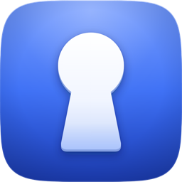
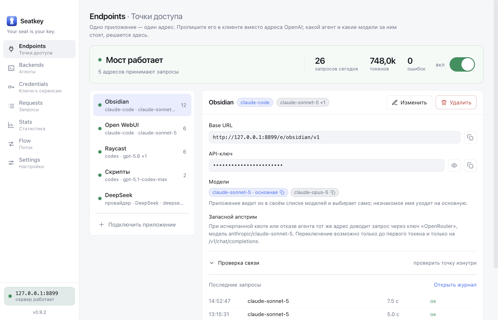

  

<h1 align="center">Seatkey</h1>

  <b>Your seat is your key.</b> 
  Чтобы подписка работала не только в терминале.

  
  
  

  <b><a href="https://seatkey.dev/">seatkey.dev</a></b> ·
  <a href="#скачать">Скачать</a> ·
  <a href="https://seatkey.dev/#faq">Вопросы</a> ·
  <a href="CHANGELOG.md">Что нового</a> ·
  <a href="#english">English</a>

Seatkey — локальный OpenAI-совместимый адрес поверх **Claude Code**, **Codex CLI** и
**Cursor Agent**, которые у вас уже установлены и оплачены подпиской. Любое приложение,
которому нужен «OpenAI API» — Open WebUI, Obsidian, Continue, Raycast, свой скрипт, —
получает адрес на `127.0.0.1`, а запрос выполняет ваш же агент. Ни API-ключа, ни хостинга.

За тем же адресом можно держать и остальные доступы: OpenAI-совместимого провайдера,
локальную модель, корпоративный сервис со своим токеном. Секреты лежат в связке ключей
ОС, а не россыпью по конфигам десятка приложений.

  <picture>
    <source media="(prefers-color-scheme: dark)" srcset="shots/app-endpoints.png">
    
  </picture>

Код приложения закрыт. Здесь лежат сборки, список изменений и сайт
[seatkey.dev](https://seatkey.dev/); приложение проверяет обновления тоже здесь —
анонимно и без токена.

## Скачать

**[Последний релиз →](../../releases/latest)** Все версии — в [Releases](../../releases),
что в них нового — в [CHANGELOG.md](CHANGELOG.md).

| Mac | Файл |
|---|---|
| Apple Silicon (M1 и новее) | `Seatkey-<версия>-arm64-mac.zip` |
| Intel | `Seatkey-<версия>-mac.zip` |

1. Распакуйте архив и перенесите `Seatkey.app` в «Программы».
2. Откройте его. Сборка подписана Apple Developer ID и нотаризована — macOS откроет её
   сразу, без «Всё равно открыть» и команд в терминале.
3. Скопируйте адрес первой точки доступа и вставьте его в своё приложение. Ключ лежит
   там же, рядом.

Файлы `.blockmap` и `latest-mac.yml` качать не нужно: они служебные, их берёт
автообновление. Сборок под Windows и Linux пока нет — код кроссплатформенный, и если
нужна сборка под вашу систему, [напишите](../../issues/new/choose): очередь
определяется спросом.

**Нужно:** macOS и хотя бы один из агентов — [Claude Code](https://docs.anthropic.com/en/docs/claude-code),
[Codex CLI](https://github.com/openai/codex) или [Cursor Agent](https://cursor.com/cli) —
с выполненным входом. Seatkey найдёт их сам.

## Что умеет

- **Свой адрес на каждое приложение.** Точка доступа привязана к агенту и его моделям,
  со своим системным промтом и ключом. Поменять модель или агента — в Seatkey, конфиг
  приложения не трогается.
- **`/v1/chat/completions`, `/v1/messages`, `/v1/responses`, `/v1/models`** — OpenAI,
  Anthropic и Responses API, со стримингом.
- **Настоящий tool calling.** Инструменты клиента становятся временным MCP-сервером, и
  агент вызывает их по-настоящему — на всех трёх агентах.
- **Быстро и экономно.** Процесс агента живёт между ходами: 0,8 с до первого токена
  вместо 3,6–6,7 с холодного старта, и историю диалога не нужно пересылать заново.
- **Не только подписка.** За адресом может стоять DeepSeek, OpenRouter, Ollama, LM Studio
  или любой HTTP-сервис; у точки к агенту есть запасной провайдер на случай, если квота
  кончилась.
- **Ключи к сервисам** — Jira, Jenkins, ключи провайдеров — в связке ключей ОС, со сроком
  на виду. Отмеченные становятся инструментами агента: он сходит в Jira, не видя токена.
- **Видно каждый запрос.** Журнал, поток в реальном времени, статистика с долей кэша и
  тем, сколько то же самое стоило бы по API.

Чего Seatkey не умеет и почему — сказано прямо на [сайте](https://seatkey.dev/#honest).
Главное: он запускает **официальные CLI** как подпроцессы и не трогает их токены, поэтому
не может быть быстрее или дешевле одного хода самого агента.

## Лицензия

Сейчас ранний доступ. Приложение платное; ключ офлайновый и привязан к одному компьютеру.
Скачать и посмотреть можно без ключа: интерфейс, настройки и диагностика работают,
закрыты только сами запросы к моделям.

Чтобы получить ключ, откройте **Settings → License**, скопируйте отпечаток компьютера
(`SK-XXXX-XXXX-XXXX`) и **[запросите ключ](../../issues/new?template=license.yml)**.
Отпечаток — хеш идентификатора установки системы, ничего о вас он не сообщает.

## Обновления

Приложение проверяет их само и показывает в **Settings → App**. Обновление скачивается в
фоне и ставится по кнопке; сам Seatkey установку не начинает никогда — он держит
локальный сервер, и перезапуск оборвал бы запросы подключённых приложений. Чтобы узнавать
о новых версиях, нажмите **Watch → Custom → Releases** вверху этой страницы.

<b>С 0.9.2 и старше — один раз вручную</b>

Те версии подписаны прежним, самодельным сертификатом и новую сборку своей не признают:
обновление из настроек закончится ошибкой. Скачайте архив последнего релиза и замените
`Seatkey.app` в «Программах» — настройки, ключ и история запросов останутся на месте.

При первом запуске macOS спросит пароль для «Seatkey Safe Storage»: введите его и
нажмите «Разрешать всегда». Дальше обновления снова приходят сами.

## Приватность

Пока за адресом стоит агент, всё происходит между вашими приложениями и вашим же агентом
на этой машине: сервер слушает только `127.0.0.1`, история запросов лежит в локальной
базе, тела запросов не пишутся, пока вы не включите это сами. Телеметрии нет.
Единственный сетевой запрос по инициативе самого Seatkey — анонимная проверка обновлений
здесь, на GitHub; выключается в настройках.

## Сообщить об ошибке

1. Посмотрите **Settings → Doctor**: там проверено то, что обычно ломается, — агенты и
   вход в них, порт, лицензия, ключи к сервисам, сертификаты.
2. Там же нажмите **«Отчёт о проблеме»** — один файл с версиями, результатом Doctor,
   настройками без ключей и последними запросами. Промты попадают в него только по
   отдельной галочке. Просмотрите файл перед отправкой: issue здесь публичные.
3. [Откройте issue](../../issues/new/choose): версия Seatkey и macOS, какой агент и
   клиент, что делали и что получилось.

---

## English

**Seatkey** turns the coding-agent subscriptions you already pay for — **Claude Code**,
**Codex CLI**, **Cursor Agent** — into a local OpenAI-compatible endpoint on `127.0.0.1`.
Point Open WebUI, Obsidian, Continue, Raycast or your own scripts at it, and your own
agent runs the request. No API key, no hosting. The same address can also front an
OpenAI-compatible provider, a local model or an internal service, with secrets kept in
the OS keychain.

- **Download:** [latest release](../../releases/latest) — `-arm64-mac.zip` for Apple
  Silicon, `-mac.zip` for Intel. Signed with Developer ID and notarized by Apple; it
  updates itself after you confirm (Settings → App).
- **Requirements:** macOS and at least one of Claude Code, Codex CLI or Cursor Agent,
  signed in. The interface is in Russian for now. Windows and Linux builds aren't
  published yet — ask in issues.
- **License:** paid, early access. The app runs without a key; only model requests need
  one. Copy your machine fingerprint from Settings → License and
  [request a key](../../issues/new?template=license.yml).
- **Privacy:** no telemetry. The only request Seatkey makes on its own is an anonymous
  update check against this repository, and it can be turned off.
- **Bug reports:** Settings → Doctor → «Отчёт о проблеме» (problem report; review the
  file first, issues are public), then [open an issue](../../issues/new/choose).
- **More:** [seatkey.dev/en](https://seatkey.dev/en/) · [What's new](CHANGELOG.md) (in Russian)

The app's source code is closed. This repository holds releases, the changelog and the
website.
